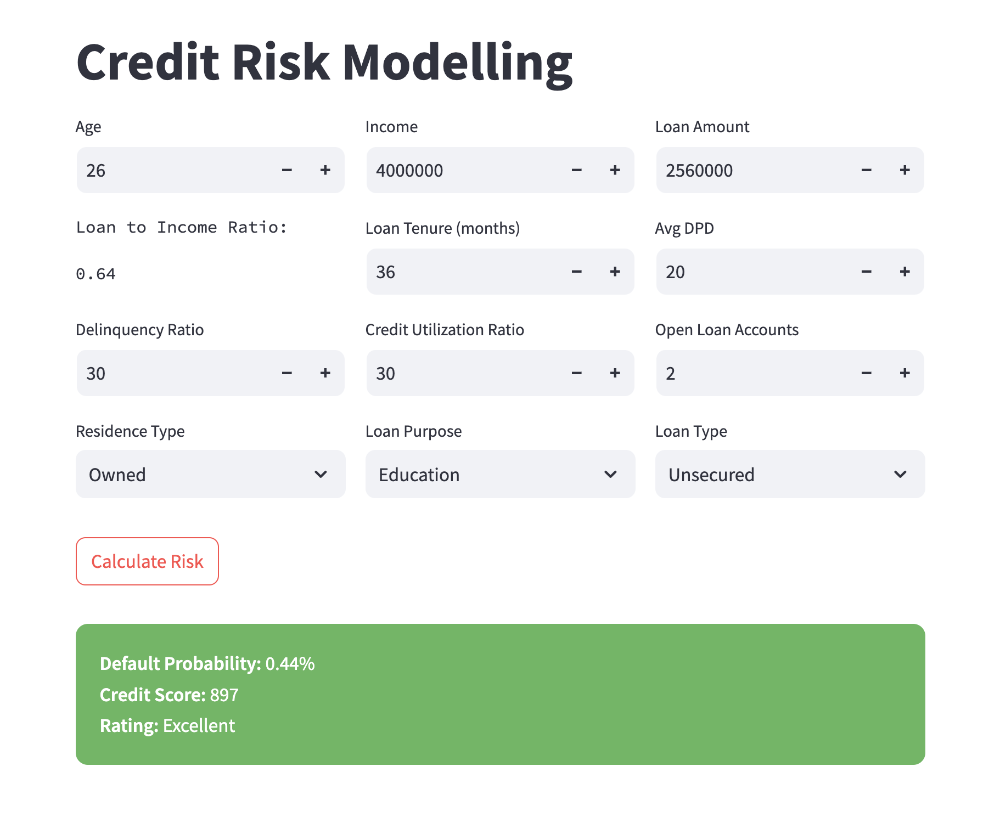
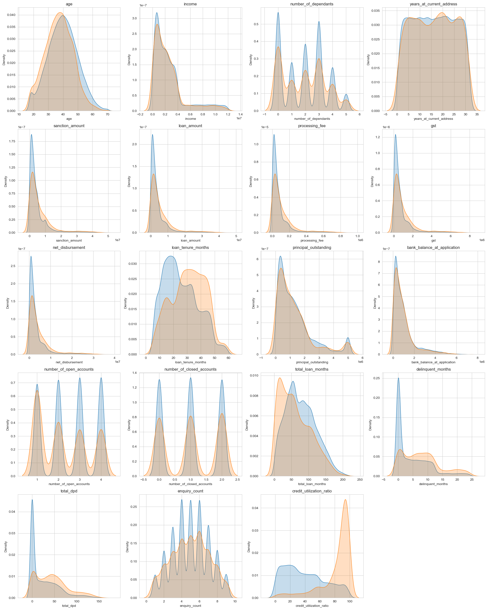
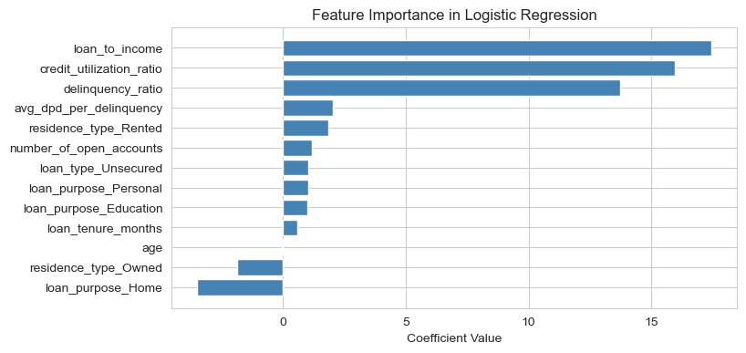
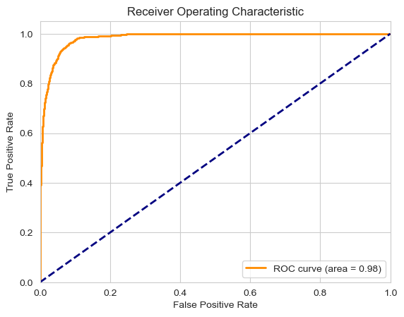
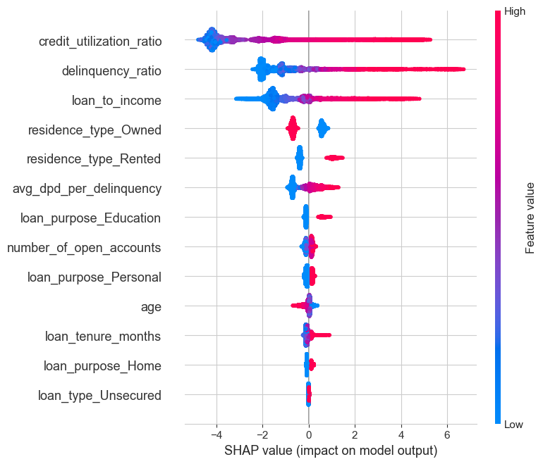

# Credit Risk Scorecard Model – End-to-End ML Project

This project involves building and deploying a machine learning-based **credit risk scorecard** for XYZ Finance, an NBFC (Non-Banking Financial Company) in India. The goal is to classify loan applicants into **Poor**, **Average**, **Good**, or **Excellent** credit categories using loan, customer, and bureau-level data.

---

## 🌐 Objective

- Build a model that XYZ Finance's **Risk Unit** can use to **assess the creditworthiness** of loan applicants.
- Incorporate credit scorecard logic similar to CIBIL.

### 🎯 Success Criteria

- AUC, Gini > 85%
- KS Statistic > 40
- Most predictive power within the first 3 deciles
- Model interpretability (via SHAP or feature analysis)

---

## 📂 Dataset Overview

- **Source**: Loan data from XYZ Finance
- **Timeframe**:
  - Training: Feb 2022 – Feb 2024
  - Out-of-time (test): Mar 2024 – May 2024
- **Target Variable**: `default` (binary: 1 = defaulted, 0 = not defaulted)
- **Split**: 75% Training | 25% Test

### 📊 Feature Categories

#### ✅ Loan Features:

- Loan Amount, Sanctioned Amount, Net Disbursement
- Loan Purpose, Loan-to-Income Ratio
- Days Past Due (DPD)

#### 🌐 Bureau Data:

- Number of Open & Closed Accounts
- Inquiry Count
- Credit Utilization Ratio
- Delinquent Months
- Months Since Last Delinquency

#### ✅ Engineered Features:

- **Loan-to-Income Ratio**: captures debt burden
- **Delinquency Ratio**: delinquent\_months / loan\_tenure\_months
- **Average DPD per Delinquent Month**: total\_dpd / delinquent\_months

---

## 🔄 Data Preprocessing

- Removed nulls, outliers, and invalid values (e.g., Loan Purpose imputation)
- Split train/test early to avoid data leakage
- **Encoding**:
  - WOE and IV for categorical features
  - VIF for numerical multicollinearity detection
- Feature scaling: Min-Max scaling for numeric inputs

---

## 🎯 Model Development

- Models Trained:
  - Logistic Regression
  - XGBoost
  - Random Forest
- Hyperparameter Tuning:
  - Used `RandomizedSearchCV` and `Optuna`

### ✅ Best Model: **XGBoost** But Selected **Logistic Regression**

- Chosen for its performance, explainlability and interpretability

---

## 🔢 Model Evaluation

- **AUC Score**: 98
- **KS Statistic**: 85
- **Gini Coefficient**: 96
- Strong separation in first 3 deciles
- Classification Report metrics indicate good balance between precision and recall

---

## 📊 Key Insights

### Feature Impact:

- **High LTI** ➔ higher default risk
- **Higher Delinquency Ratio** ➔ strong correlation with defaults
- **Avg DPD per Delinquent Month** ➔ most powerful predictor

### Why Loan Amount or Income Alone Don’t Work:

- Separately, these do not correlate well with defaults
- But combined as a **ratio (LTI)** they provide strong signal

---

## 🚀 Deployment

- Built an interactive **Streamlit app** for real-time prediction
- User inputs include loan details, income, and credit history
- Model predicts **default probability** and assigns:
  - **Poor** (Red)
  - **Average** (Orange)
  - **Good** (Light Green)
  - **Excellent** (Dark Green)
- Predictions are styled as cards with colors for UX clarity

---

## 📊 Results Snapshot

| Metric           | Value         |
| ---------------- | ------------- |
| AUC              | 0.98        |
| KS Statistic     | 85          |
| Gini Coefficient | 0.96         |
| Best Model       | Logistic Regression |                    
| Frontend         | Streamlit App |

---

## 👩‍💼 Tools & Tech

- Python, pandas, numpy, scikit-learn, XGBoost
- Visualization: matplotlib, seaborn, SHAP
- Hyperparameter tuning: Optuna, RandomizedSearchCV
- Model explainability: SHAP
- UI: Streamlit

---

## 📅 ML Lifecycle Stages

1. **Problem Definition**
2. **Data Collection**
3. **Data Cleaning & EDA**
4. **Feature Engineering**
5. **Feature Selection (IV, VIF)**
6. **Model Training**
7. **Hyperparameter Tuning**
8. **Evaluation**
9. **Interpretation**
10. **Deployment (Streamlit)**

---

## 🌟 Key Achievements

- Built a production-ready credit scorecard system
- Achieved 98% accuracy, 85 KS stat
- Clear business insights using engineered features
- Delivered usable Streamlit app for risk team

---